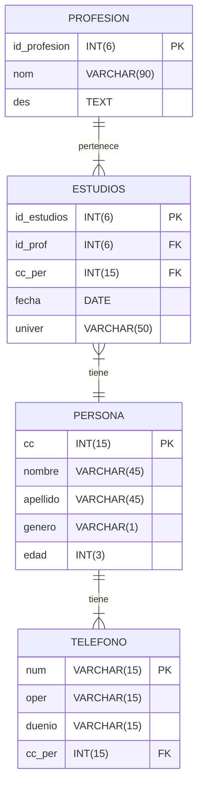

# Documentacion lab--01

## Stack

- __.NET 10__
- __MS SQL Server 2022__
- __REST__
- __Swagger 3__

---

## Modelo de datoso

Realizar __endpoints__ y __vistas__ para el __CRUD__ del siguiente modelo de datos:

---

## Entregables

- URL **TAG** del repositorio git (_Github/Gitlab/Bitbucket/etc_)
    - README con la configuración, pasos para configurar ambiente, compilación y despliegue.
    - Script DDL y DML
    - Código fuente.

- Documento:
    1. Portada
    2. Marco conceptual
    3. Diseño
    4. Procedimiento
    5. Conclusiones y lecciones aprendidas
    6. Referencias

## Procedimiento

Para el laboratorio 1 el procedimiento que deben hacer es el siguiente

1. crear el repositorio git publico en github o en cualquier sistema git nombre del repositorio debe ser personapi-dotnet
2. instalar SQL Server 2019 Express modo Básico
3. instalar SQL Server Management Studio 18
4. crear la base de datos llamada persona_db y darle la propiedad al usuario sa
5. crear las tablas según el modelo
6. instalar Visual Studio Community 2022 con los complementos
    1. Desarrollo ASP.NET y web
    2. Almacenamiento y procesamiento de datos
    3. Plantillas de proyecto y elementos de .Net Framework
    4. Caracteristicas avanzadas de ASP.NET
7. clonar el repositorio local git a partir del remoto creado previamente
8. en Visual Studio Community 2022
    1. crear un proyecto
    2. seleccionar la plantilla Aplicación web de ASP.NET Core (Modelo-Vista-Controlador)
    3. el nombre de la aplicación debe ser el mismo del repo personapi-dotnet
    4. Framework .NET 6.0 sin autenticación y sin configuración HTTPS
    5. en el menu Ver activar la vista de Explorador de objetos de SQL Server
    6. agregar y probar la conexión de tipo local express
    7. ir al menu Herramientas>Administrador de paquetes NuGet>Consola del Administrador de paquetes
    8. En el explorador de soluciones, hacer clic derecho en dependencias e ir a Administrar paquetes NuGet e instalar
        1. Microsoft.EntityFrameworkCore
        2. Microsoft.EntityFrameworkCore.SqlServer
        3. Microsoft.EntityFrameworkCore.Tools
    9. crear entidades, en el explorador de soluciones, en la carpeta Models hacer clic derecho y en agregar agregar una carpeta llamada Entities
    10. en la Consola del Administrador de paquetes escribir
        1. `Scaffold-DbContext "Server=localhost\SQLEXPRESS;Database=persona_db;Trusted_Connection=True;TrustServerCertificate=true"
           Microsoft.EntityFrameworkCore.SqlServer -OutputDir Models/Entities`
        2. se crean las clases entidad a partir de las tablas existentes de la base de datos y el contexto
        3. agragar la cadena de coneccion en appsettings.json
    11. crear interfaces
    12. crear repositorios
    13. crear controladores
    14. desplegar
9. hacer push al repositorio
10. crear TAG

como material complementario y de guía pueden consular los siguientes enlaces

- https://www.youtube.com/watch?v=6nT-RjMEG0o&ab_channel=hdeleon.net
- https://www.youtube.com/watch?v=28LjewDjaz4&ab_channel=hdeleon.net
- https://dev.to/veronicaguamann/api-con-aspnet-mvc-6-y-sql-server-mediante-entity-framework-core-6-code-first-parte-1-2i05
- https://dev.to/veronicaguamann/api-con-aspnet-mvc-6-y-sql-server-mediante-entity-framework-core-6-code-first-parte-2-4lbg
- https://www.c-sharpcorner.com/article/building-asp-net-web-api-in-net-core-with-entity-framework/
- https://learn.microsoft.com/es-es/dotnet/framework/data/adonet/entity-data-model
